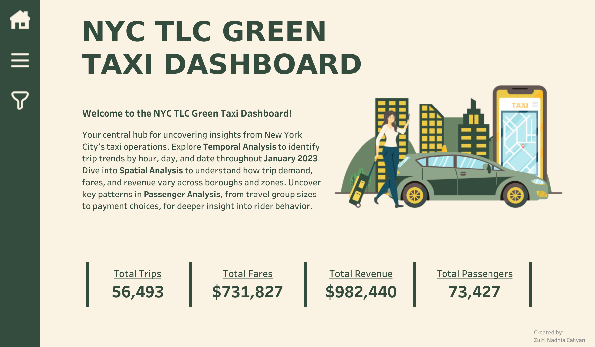

# NYC GREEN TAXI DEMAND AND OPERATIONS ANALYSIS  
This analysis of New York City's Green Taxi service, based on January 2023 trip data, identifies key patterns in demand, fare structure, and passenger behavior, offering recommendations to optimize fleet deployment, pricing strategies, and service planning. The findings highlight peak demand times, high-traffic locations, factors influencing fare amounts, and preferences for digital payments, providing actionable insights for improving operational efficiency and service equity.

## I. INTRODUCTION

### **Background**  
With over 8 million residents in a densely populated and diverse city, New York City requires a robust and adaptable transportation system. To manage this, the New York City Taxi and Limousine Commission (TLC) was established in 1971 to license and regulate the city’s for-hire services, including Yellow and Green Taxis, app-based ride services (like Uber and Lyft), commuter vans, and paratransit vehicles. 

While Yellow Taxis primarily serve central Manhattan, Green Taxis, that launched by the TLC in 2013 under the Livery Passenger Enhancement Program, were introduced to expand street-hail service to the outer boroughs and upper Manhattan, where transportation access had historically been limited. Unlike Yellow Taxis, Green Taxis are restricted from picking up passengers in central Manhattan and instead focus on areas with lower taxi availability.

Analyzing how Green Taxis are used is essential for improving transportation equity and operational efficiency in underserved neighborhoods. Examination of TLC-collected trip data can reveal patterns in demand, highlight how trip characteristics influence fare structures, and provide insights into passenger behavior. These findings can support informed decision-making by the TLC and other stakeholders regarding vehicle distribution, pricing strategies, and service planning, ultimately contributing to a more efficient and inclusive transportation system across New York City.  

### **Business Problems**  
Green Taxis were introduced to improve transportation access in NYC’s outer boroughs and upper Manhattan, yet challenges in optimizing their operations remain. This project addresses the following key questions:

1. **When is the peak demand?**  
Identifying peak times can improve vehicle availability and reduce wait times.

2. **Where is high demand concentrated?**  
Mapping high-demand pickup areas helps position drivers more effectively and minimize idle time.

3. **What affects fare amounts?**  
Analyzing trip features like distance and duration offers insight into fare structure and driver earnings.

4. **How do passengers travel and pay?**  
Understanding ride-sharing patterns and payment preferences supports better service planning.

### **Objectives**  
To address the key business problems, this analysis focuses on the following objectives:

1. **Determine peak demand periods** by analyzing trip volumes across different hours and days.
2. **Identify high-demand locations** by examining pickup distribution across boroughs and zones.
3. **Analyze fare-influencing factors** by exploring the relationship between trip characteristics (distance and duration) and fare amounts.
4. **Understand passenger behavior** by analyzing patterns in passenger count and preferred payment methods.

### **Scope and Limitations**  
This analysis uses January 2023 trip data from the NYC Taxi and Limousine Commission (TLC) and excludes seasonal variations, long-term trends outside the timeframe, external factors (such as weather, traffic, or events), and comparisons with app-based ride services like Uber or Lyft.

---

## II. DATA PREPARATION
Data preparation involves both **data understanding** and **data cleaning**. Anomalies identified during the data understanding phase are addressed during data cleaning. In this project, the data cleaning process includes handling missing values, correcting data types, removing duplicate records, resolving inconsistencies, and detecting and managing outliers to ensure a clean and reliable dataset.  

1. **Handling Missing Values**
    - Dropped the column: `ehail_fee` (100% missing).  
    - Filled rows with mode: `trip_type`, `store_and_fwd_flag`, `RatecodeID`, `payment_type`.  
    - Filled rows with median: `passenger_count`, `congestion_surcharge`.  
    - Dropped rows with missing values: `Borough_pickup`, `Zone_pickup`, `service_zone_pickup`, `Borough_dropoff`, `Zone_dropoff`, `service_zone_dropoff`.  
   
2. **Handling Incorrect Data Types**  
    - Converted to datetime: `lpep_pickup_datetime`, `lpep_dropoff_datetime`.  
    - Converted to integer: `passenger_count`.  
    - Converted to categorical: `VendorID`, `RatecodeID`, `PULocationID`, `DOLocationID`, `store_and_fwd_flag`, `payment_type`, `trip_type`.  
    - Converted to boolean: `store_and_fwd_flag` ('Y' → True, 'N' → False).  

3. **Handling Duplicate Data**  
    - Found and dropped 168 duplicate rows based on critical columns: `VendorID`, `RatecodeID`, `payment_type`, `trip_type`, `lpep_pickup_datetime`, `lpep_dropoff_datetime`, `PULocationID`, `DOLocationID`, `passenger_count`, `trip_distance`.  

4. **Handling Inconsistent Data**  
    - Dropped rows with negative values: `fare_amount`, `total_amount`.  
    - Replaced negative values with 0: `extra`, `tip_amount`, `congestion_surcharge`.  
    - Corrected values: `mta_tax` = 0.50, `improvement_surcharge` = 1.00.  
    - Replaced 0 with mode/median: `passenger_count` → mode, `trip_distance` → median.  
    - Replaced invalid values: `RatecodeID` (values outside 1–6).  
    - Dropped rows with: >6 passenger_count, invalid pickup/dropoff datetime, `lpep_pickup_datetime` = `lpep_dropoff_datetime`, financial values outside valid range (e.g., `fare_amount` < $3, `tip_amount` > $100).  
    - Fixed typos and formatting in categorical columns (e.g., lowercased values).  

5. **Handling Outliers**  
    - Detected outliers: `passenger_count`, `trip_distance`, `fare_amount`, `extra`, `tip_amount`, `tolls_amount`, `total_amount`, `congestion_surcharge`.
    - Dropped severe outliers: `trip_distance`, `fare_amount`, `tip_amount`, `tolls_amount`, `total_amount`.
    - Retained acceptable values: `passenger_count`, `extra`, `congestion_surcharge`.  

---

## III. DATA ANALYSIS  
Data analysis involves transforming data to uncover patterns and insights that support decision-making. In this project, NYC Green Taxi trip data is analyzed post-cleaning to explore key operational opportunities by identifying peak demand times and locations, examining fare-trip relationships, and understanding passenger behavior by group size and payment method. This chapter uses EDA, visualizations, descriptive stats, and inferential analysis to reveal insights for improving taxi operations.

### 1. Trip Demand Over Time Analysis  
This section explores how passenger demand varies by time, helping improve service availability and operational planning through data-driven insights.  

- **Hourly Demand:** A line chart shows trip volume by hour, identifying peak and off-peak times for better driver scheduling and fleet allocation.  
- **Daily Demand:** Another line chart highlights demand variation across days of the week, distinguishing weekday vs. weekend trends to support commuter vs. leisure planning.  
- **Hourly by Day:** A heatmap uncovers hourly demand patterns across each day, revealing rush hour spikes and weekend late-night activity, enabling targeted deployment and shift optimization.  

### 2. Trip Demand by Location Analysis  
This section analyzes where Green Taxi trips begin, uncovering high-demand areas, time-based patterns, and weekday vs. weekend differences to support strategic fleet deployment and location-based planning.  

- **Pickup Distribution by Borough & Zone:** Using bar charts, this analysis shows trip volume by borough and top 10 zones, revealing that most pickups occur in Manhattan and East Harlem. These insights guide fleet positioning and resource focus in high-traffic areas.  

- **Hourly Demand in Top Zones:** A heatmap illustrates hourly pickup trends in the top zones, highlighting peak hours and consistently busy periods, supporting shift optimization and real-time fleet management.  

- **Weekday vs. Weekend Patterns:** A grouped bar chart compares zone-level demand between weekdays and weekends, showing location-specific changes in rider behavior. These findings inform day-specific planning and service adjustments.  

### 3. Fare-Related Factors Analysis  
This section explores how trip distance and duration impact total fare, using both **correlation analysis** and **hypothesis testing** to uncover revenue drivers and support pricing decisions.  

- **Correlation Between Distance, Duration, and Fare:** A correlation heatmap and scatterplots reveal how trip distance and duration affect fare, reflecting NYC's per-mile and per-minute pricing. The analysis helps identify the strongest predictors of fare, useful for fare modeling and revenue forecasting.  

- **Hypothesis Testing – Impact of Trip Distance:** A one-tailed hypothesis test (Mann-Whitney U, if non-normal) compares fares for short vs. long trips (based on median distance). Using the P.I.C.O.T. framework, the test assesses whether longer trips lead to significantly higher fares. Findings support data-driven decisions on fare structure, long-trip service strategies, and revenue optimization.  

### 4. Passenger Behaviour Analysis  
This section explores how passengers use taxi services, focusing on group size and payment preferences to uncover behavior patterns that inform service planning and inclusivity.  

- **Passenger Count Distribution:** A horizontal bar chart shows how many passengers typically ride per trip (1–6 passengers). This highlights vehicle utilization and potential demand for ride-sharing or group travel, excluding invalid entries to ensure data relevance.  

- **Payment Method Preferences:** A bar chart illustrates the use of different payment types (e.g., Credit Card, Cash, No Charge, Dispute, Unknown, Voided Trip). This reveals digital adoption trends and helps identify passenger preferences, which are vital for service improvement and accessibility.  

---

## IV. CONCLUSION AND RECOMMENDATION  

### Conclusion  
This project analyzed green taxi trip data across time, location, fare factors, and passenger behavior to uncover key usage patterns and operational opportunities.

1. **Time-Based Demand**
    - Weekday demand is structured, with Tuesday as the busiest day and peaks at 8 AM, 4 PM, and 5 PM.
    - Commuting hours (7–9 AM, 3–6 PM) show consistently high demand; 6 PM is the busiest hour overall.
    - Late night (12–5 AM) has minimal activity—ideal for maintenance and repositioning.
    - Weekend demand is lower and leisure-driven, peaking softly at 3 PM, with Sunday being the slowest.

2. **Location-Based Demand**
    - Manhattan dominates pickups (over 60%), especially East Harlem, needing continuous, peak-aware coverage.
    - Queens and Brooklyn offer growth areas: Queens via airport and residential demand, Brooklyn via event zones like Fort Greene.
    - Bronx and Staten Island have <2% of trips, suitable for limited or on-demand service.

3. **Fare Insights**
    - Fare is highly correlated with distance (0.86), making it key for pricing and revenue strategies.
    - Trip duration has little impact on fare (0.09) and is less useful for planning.
    - Distance and duration are not strongly linked (0.07), underscoring traffic unpredictability.

4. **Passenger Behavior**
    - Most trips (86.75%) are solo, favoring small, efficient vehicles. Ride-sharing could be promoted via incentives.
    - Larger groups are rare, suggesting limited use for large vehicles.
    - Card payments lead (64.88%), supporting loyalty programs and better data collection.
    - Cash is still used (34.79%), especially by tourists or older adults—highlighting a need for inclusive digital transition.

### Recommendation  
Drawing on insights from the analysis of Trip Demand Over Time, Trip Demand by Location, Fare-Related Factors, and Passenger Behavior, the following recommendations aim to optimize Green Taxi operations:  

1. **Time-Based Demand Optimization:**  
    - Green Taxi services should increase fleet presence during weekday peak hours (6–10 AM and 3–6 PM), especially on Tuesdays and Fridays. On weekends, focus on 10 AM–6 PM leisure traffic.  
    - Reduce operations during low-yield times, like 12–5 AM and Sundays, using those periods for maintenance, driver training, or system updates.  
    Apply surge pricing and driver incentives during peak demand windows, while offering discounts and loyalty rewards during off-peak hours to better balance supply and demand.  

2. **Location-Based Fleet Strategy:**  
    - Prioritize Manhattan, particularly East Harlem, due to its consistent, high demand throughout the day.  
    - Adopt a tiered coverage strategy:  
        - Tier 1: High-density zones (e.g., East Harlem, Central Park) receive continuous coverage.  
        - Tier 2: Moderate-demand areas (e.g., Forest Hills, Astoria) are covered during their peak hours.  
        - Tier 3: Low-demand areas (e.g., Bronx, Staten Island) receive minimal or on-demand coverage.  
    - In Queens, allocate airport-appropriate vehicles and manage overflow using midday rotations. Reserve additional capacity for zones with late afternoon peaks like Central Harlem and Astoria.  

3. **Fare Modeling and Revenue Strategy:**  
    - Build fare models around trip distance, which has a stronger correlation with fare than duration.  
    - Encourage longer trips during off-peak times through driver reward programs.  
    - Utilize real-time traffic data to improve routing efficiency and trip turnover.  
    - Focus marketing on high-value segments, such as airport transfers and cross-borough trips, which offer better revenue potential. 

4. **Passenger Behavior and Service Design:**  
    - Given that 87% of trips involve a single passenger, prioritize compact, fuel-efficient vehicles.  
    - Promote ride-sharing in high-demand zones through app features, discounts, and sustainability messaging to help reduce congestion.    
    - Deploy larger vehicles strategically around airports, hotels, and event venues, with pre-booking options to match passenger group sizes.  
    - Leverage the high rate of digital payments (65%) for customer insights, loyalty programs, and transparent operations. Encourage further digital adoption through perks while maintaining cash options for accessibility.  

---

## REFERENCES
New York City Taxi and Limousine Commission (TLC). (n.d.). *About TLC*. NYC.gov. Retrieved March 31, 2025, from https://www.nyc.gov/site/tlc/about/about-tlc.page

New York City Taxi and Limousine Commission (TLC). (n.d.). *TLC Trip Record Data*. NYC.gov. Retrieved March 31, 2025, from https://www.nyc.gov/site/tlc/about/tlc-trip-record-data.page

New York City Taxi and Limousine Commission (TLC). (n.d.). *Trip Record User Guide* [PDF]. NYC.gov. Retrieved March 31, 2025, from https://www.nyc.gov/assets/tlc/downloads/pdf/trip_record_user_guide.pdf

New York City Taxi and Limousine Commission (TLC). (n.d.). *Taxi Fare*. NYC.gov. Retrieved April 4, 2025, from https://www.nyc.gov/site/tlc/passengers/taxi-fare.page  

NYU Furman Center. (n.d.). *East Harlem neighborhood profile*. Retrieved April 6, 2025, from https://furmancenter.org/neighborhoods/view/east-harlem  

---

## TOOLS USED
- Python (Pandas, NumPy): Data cleaning, manipulation, and analysis
- Matplotlib & Seaborn: Exploratory data visualization
- Jupyter Notebook: Analysis workflow and documentation
- Tableau: Interactive dashboard development and visualization  
  [NYC TLC Green Taxi dashboard](https://public.tableau.com/views/NYCTLCGreenTaxiDashboard/Home?:language=en-US&:sid=&:redirect=auth&:display_count=n&:origin=viz_share_link)

  
